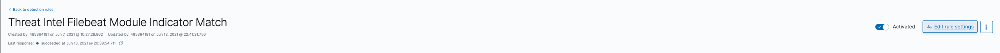
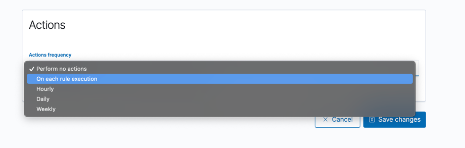
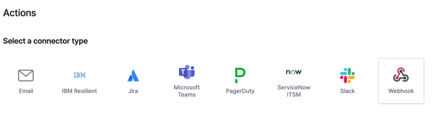
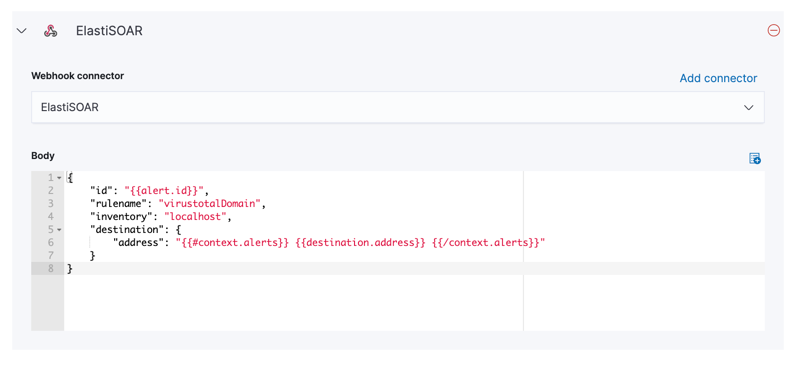

# ElastiSOAR
A small PoC for SOAR-lite functionality using Elasticsearch and Ansible

## Intro 
I wanted to build a quick tool to speed up menial tasks for analysts. Being able to automate things like Virus Total, or Shodan, tasks. Or even automating protective responses can save hundreds of work hours. 

This tool will listen for a webhook from an Elasticsearch cluster, and pull out values such as: 
- hostname
- alert name
- user name
- process name

I've tried to map several ECS field names into Structs to make it easy to extend this depending on what rules you have. 

A lookup function will take the value of `rulename` in your Alert's Request, and then search for the corresponding playbook. 


## Make it work

### Detection Engine
In Kibana, go to the Detections tab within Elastic Security
- Select the rule you wish to use ElastiSOAR with
- Click on 'Edit Rule settings'
  
  
- In the actions tab, confirm the frequency you want the rule to trigger.
  
  
- Under action type, select webhook.
  
  
  - If you don't have a connector defined already then please set this up (the default port for ElastiSOAR is 8080)

- Create a document body that contains the following values as a minimum.
  - id
  - rule name
  - inventory (Set this to something like 'localhost')

    
  

### Watcher
- Create a watch that looks for your specific criteria
- Under the action part of the watch make sure that the payload contains at a minimum: 
  - Hostname
  - Username
  - Alert Name 

> for the time being - you will need to add hostname and username, even if those values are blank. 

### Example Payload
```json
{
    "id": "1234abcd",
    "rulename": "virustotalDomain",
    "inventory" : "localhost",
    "host": {
        "name": "super"
    },
    "user": {
        "name": "npalmer"
    },
    "destination": {
        "address": "bbc.co.uk"
    }
}
```
ElastiSOAR will pull out a few values, the first: 
- rulename: the tool will look for the existence of `virustotaldomain.yml` 
- destination.address: will be dynamically set during the execution of the playbook, and this will make a request out to virustotal.

The playbook is pretty simple: 
```yaml
---
- hosts: all
  tasks:
    - name: Get Virus Total Results for Domain
      uri:
        url: "https://www.virustotal.com/api/v3/domains/{{destinationAddress}}"
        method: GET
        headers:
          x-apikey: "{{ VT_API_KEY }}"
        return_content: yes
      register: vtDomainLookup

    - debug:
        msg: "{{ vtDomainLookup.json }}"
```
The playbook looks for the `VT_API_KEY` variable, which you can set in the `apikeys.yml` file. ElastiSOAR also supports Shodan API keys too. 


## To do 
- Create more playbooks
- Write some proper tests

## Props to 
- https://github.com/gin-gonic/gin
- https://github.com/apenella/go-ansible
